# My Blog - Next.js Fullstack Blog Platform
- 様々な種類の登山記録や、登山用品の紹介記事を投稿するブログ。
## スクリーンショット
- ホームページ
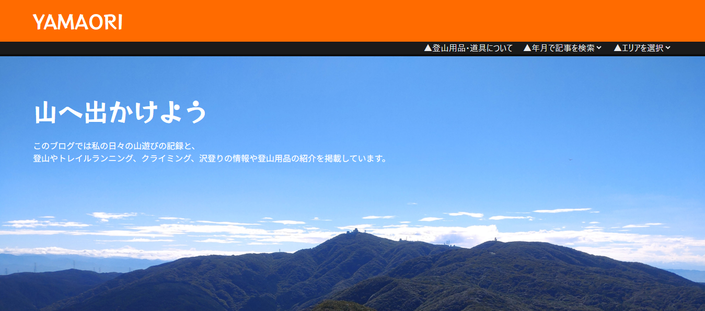
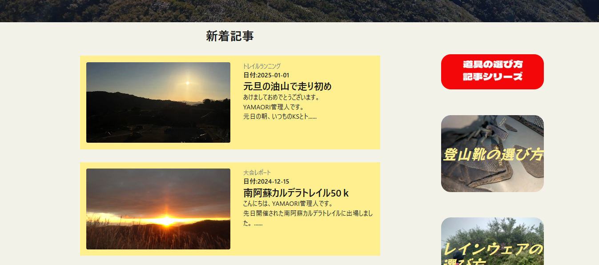
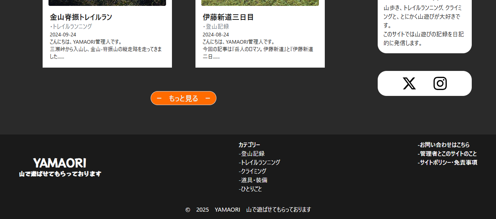
- モバイルホームページ
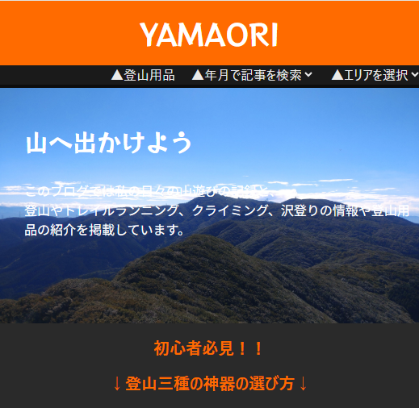
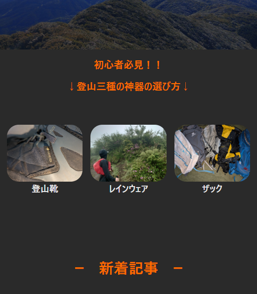
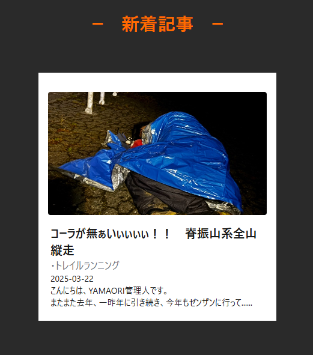
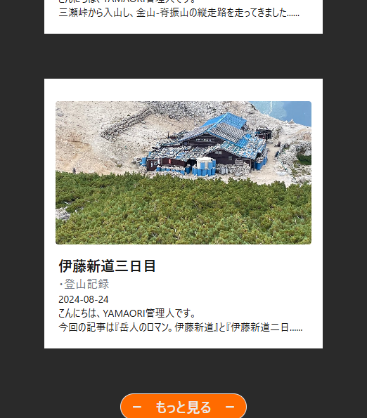
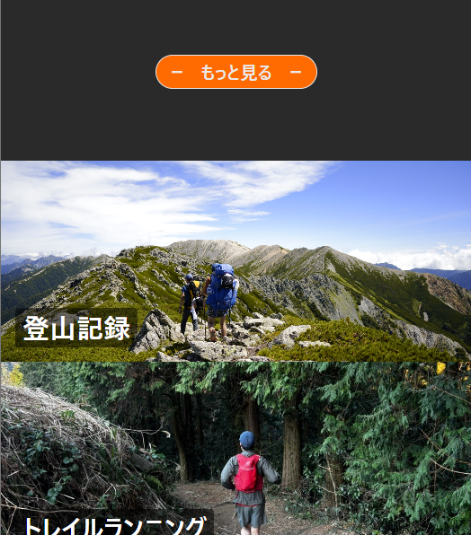
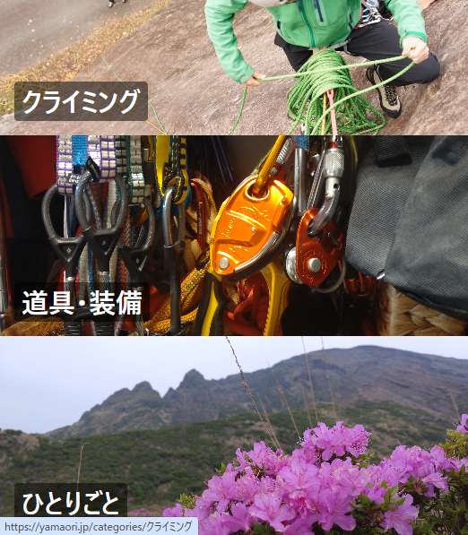
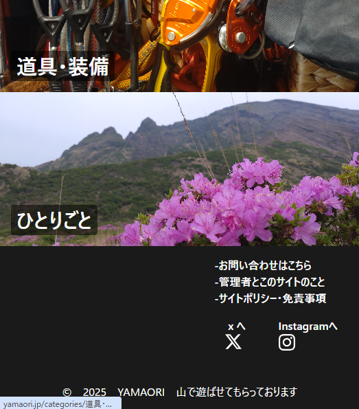
- 記事一覧ページ
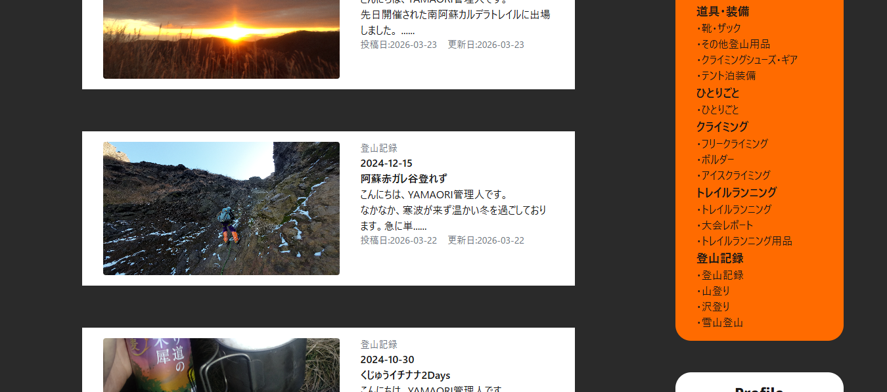
- 記事投稿ページ（Markdownエディタ）
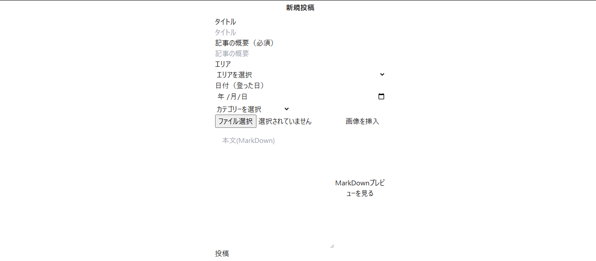
- 編集・削除用記事一覧ページ
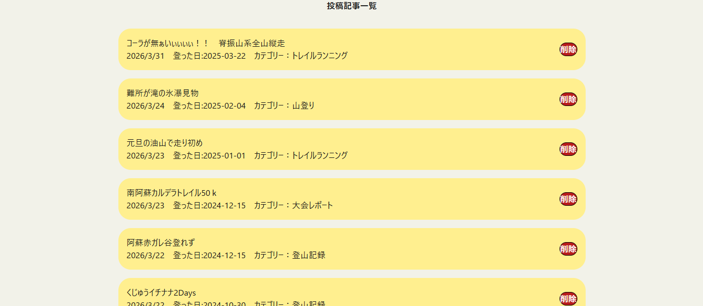
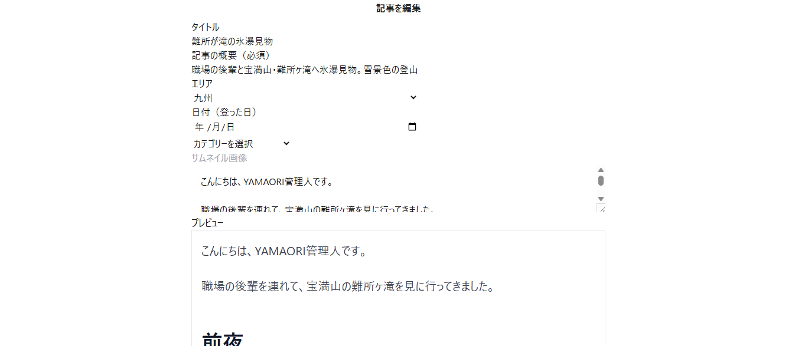
- 記事詳細ページ
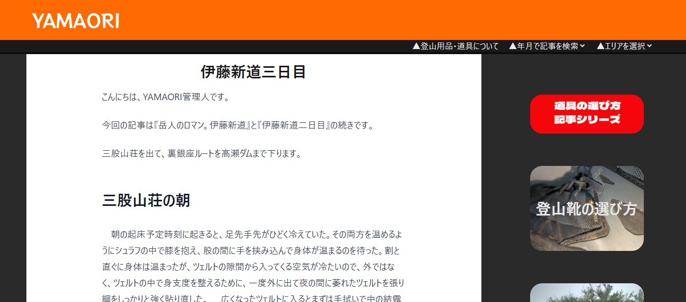
- 認証画面
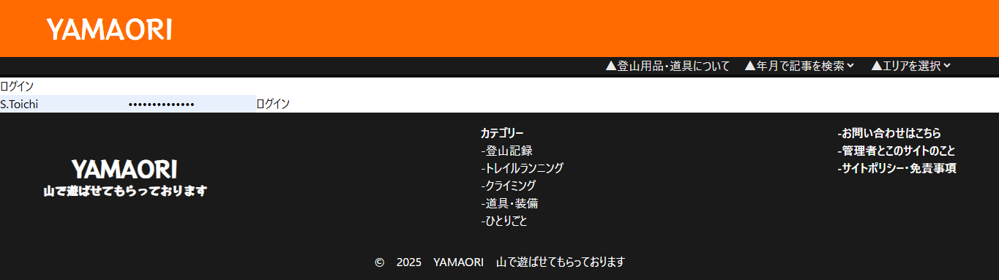
## 機能
- 認証（NextAuth）
- 画像アップロード（S3 Presigned URL）
- Markdownエディタ
- App router
- ReCAPTCHAによるスパムブロック
- resentでのメール転送機能
- カテゴリ検索
- アーカイブ記事検索
- 登山エリア別検索
- groqAPIによるSNS用キャプションの自動生成

## 技術スタック
- フロントエンド:Next.js,React,TailwindCSS
- バックエンド:Node.js,MongoDB(mongoose)
- 認証:NextAuth
- 記事表示:reactMarkdown
- セキュリティ:ReCAPTCHA,JWT
- メール送信:resent
- 画像アップロード:AWSS3
- キャプション自動生成:GroqAPI

## セットアップ
### リポジトリをクローン
git clone <https://github.com/sshhiinnt/my-blog.git>
cd my-blog

### 依存関係インストール
npm install

### 開発サーバー起動
npm run dev

## 工夫したポイント
- パフォーマンス最適化
 - 画像はS3で配信、必要な記事データのみを取得
 - 静的生成（SSG）とサーバーサイドレンダリング（SSR）の最適な組み合わせ
- UI/UX デザイン
 - Tailwind CSSとカスタムコンポーネントでレスポンシブ対応
 - Markdownエディタでプレビュー表示
- セキュリティ
 - ReCAPTCHAによるスパム対策
 - JWTトークンで認証情報管理
 - Presigned URLで安全に画像アップロード

