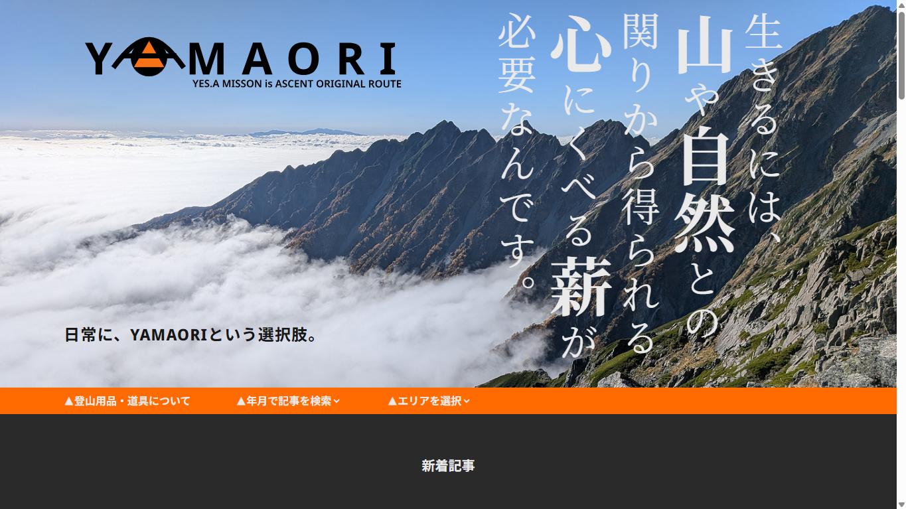
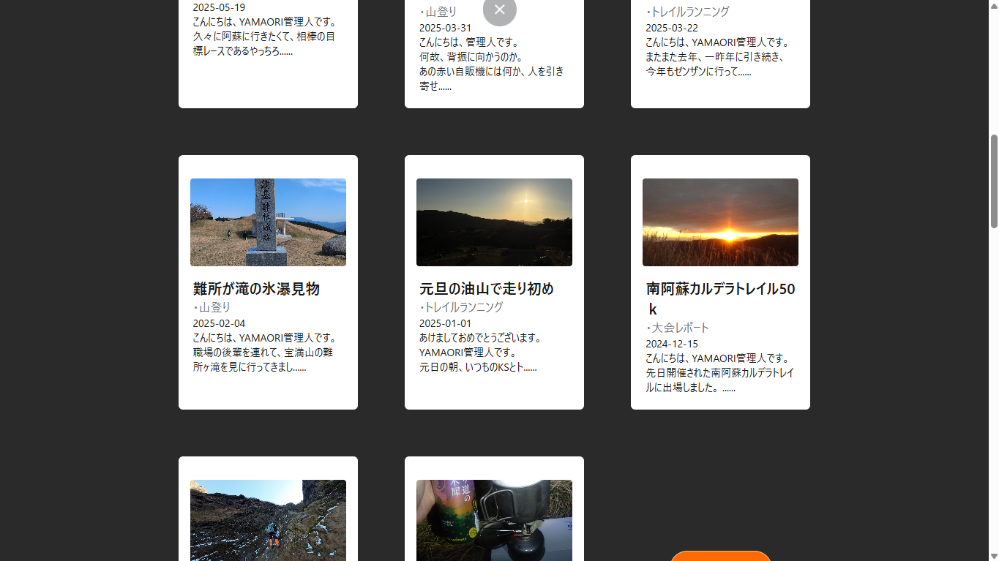
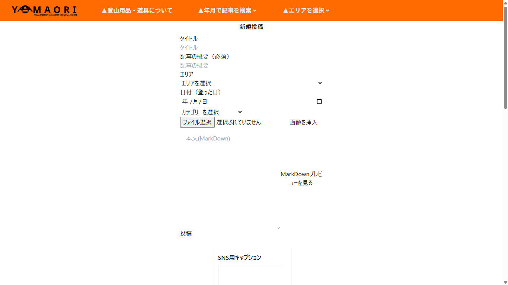
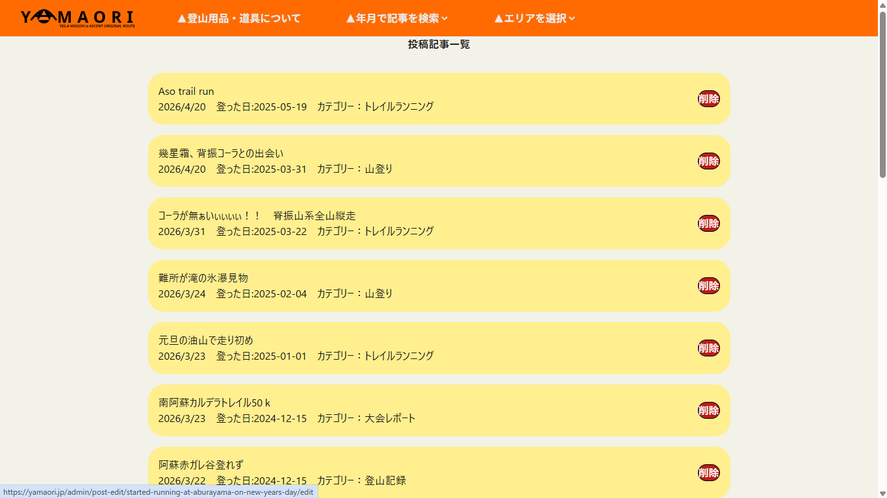
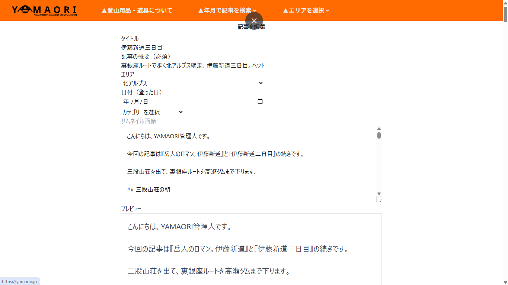
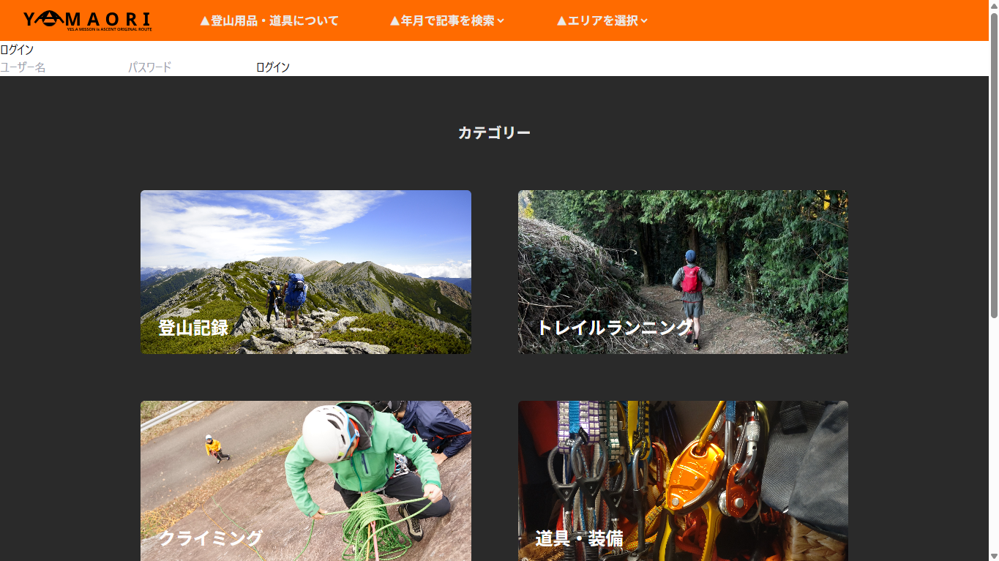

# YAMAORI
- YAMAORIは、様々な種類の登山記録や、登山用品の紹介記事を投稿するブログです。SEOやレンダリングパフォーマンスを意識し、公開・実運用前提で開発しています。
- Next.js / MongoDB / S3 / NextAuth認証のフルスタック構成。
- URL:https://yamaori.jp

### トップページ

# 開発の背景
- 登山に関する情報は、地図アプリに付随する記録として公開されているものばかりで、純粋な読み物として提供されているコンテンツが極めて少ないと感じていたので、「記録」ではなく、読みやすく整理されたコンテンツとして、情報を届けるブログを開発しました。

## 技術スタック
- フロントエンド:Next.js(App Router)/TypeScript/Tailwind CSS
- バックエンド:Next.js(Api Routes),MongoDB(mongoose)
- インフラ:AWS S3(Presigned URLによる画像アップロード)/Vercel(デプロイ)
- 認証:NextAuth
- 記事表示:reactMarkdown
- セキュリティ:ReCAPTCHA,JWT
- メール送信:Resend
- キャプション自動生成:GroqAPI

### スクリーンショット
- 記事投稿画面

- 記事管理画面

- 記事編集画面

- ログイン画面

## アーキテクチャ
- YAMAORIはNext.jsを用いたフルスタック構成で実装しています。
- 全体構成　
 - Client(Next.js)→API Router(Next.js)→MongoDB
- 画像アップロード
 - Client→Presigned URL→S3
### フロントエンド
- Next.js App Routerを使用し、ページ単位でサーバーコンポーネントとクライアントコンポーネントを適切に分離しています。
- UIはTailwind CSSで構築し、コンポーネント単位で再利用しやすくしています。
### API設計
- Next.jsのAPI Routesをバックエンドとして利用
- エンドポイントの例
 - api/categories :DBからカテゴリーを取得
 - api/s3upload:S3直接アップロード用の署名付きURLを発行(ユーザー権限認証あり)
 - api/contact:reCAPTCHA検証後、問い合わせ内容を保存し、管理者へメール送信
 - api/posts/[slug]:記事の取得・更新・削除(CRUD)
 ### 画像アップロードフロー
- サーバ負荷軽減とセキュリティを考慮し、S3への直接アップロード
- サーバーレス環境（Vercel）の制約を考慮し、ファイルをAPI経由させずS3へ直接アップロードする構成を採用
- アップロードフロー
 1. Client → API（/api/s3upload）
    - 画像情報（filename / filetype）を送信し、署名付きURLを取得
 2. API → Client 
    - Presigned POST（url + fields）を返却
 3. Client → S3 
    - 取得したurlとfieldsを用いて、FormData形式で直接アップロード
 4. S3 → Client
    - アップロード成功（HTTP 204）
 5. Client → DB
    - 生成された画像URLを記事データとして保存
- 詳細
 1. Client → API（/api/s3upload）
    - GET /api/s3upload?filename&filetype
 2. API → Client 
    - 認証チェック(NextAuth/role)
    - Presigned POST返却（AWS SDK）
 3. Client → S3 
    - 取得したurlとfieldsを用いて、FormData形式で直接アップロード
 4. S3 → Client
    - アップロード成功（HTTP 204）
 5. Client → DB
    - 画像URLを取得、整形し、Markdownへ挿入。
- 実装にあたって
    - 認証制御
        - /api/s3upload にて管理者のみURL発行可能（NextAuth）
    - クライアントから直接アップロード
        - サーバーを経由せず、クライアントからS3へ直接送信
        - 大容量ファイルでもスケーラブルに対応
    - Presigned POST
        - アップロード条件（ACLなど）を制御可能
    - UX
        - アップロード後、自動でMarkdown形式に変換し本文へ挿入
        - 画像サイズも取得し、表示制御に利用できる設計

 ### DB
 - MongoDB(Mongoose)
  - コレクションの例
    - Post(記事)
    - Category(カテゴリー)

## 主な機能
- 記事投稿(Markdownエディタ)
- 認証（NextAuth）
- 画像アップロード（S3 Presigned URL）
- App router
- ReCAPTCHAによるスパムブロック
- resentでのメール転送機能
- カテゴリ検索
- アーカイブ記事検索
- 登山エリア別検索
- groqAPIによるSNS用キャプションの自動生成

## デザイン
- デザインツール：Figma(UI設計・ワイヤーフレーム作成)
- レスポンシブ対応・UX改善を意識したデザイン～実装までを一貫して行いました。
- ブログタイトルロゴはFigmaにて作成。

## 工夫したポイント
- SEO
    - 動的メタデータ生成
    - 構造化データ(JSON-LD)
    - sitemap/robots.txt整備
- パフォーマンス最適化
    - 画像はS3で配信、必要な記事データのみを取得
    - 静的生成（SSG）とサーバーサイドレンダリング（SSR）の最適な組み合わせ
- UI/UX デザイン
    - Tailwind CSSとカスタムコンポーネントでレスポンシブ対応
    - Markdownエディタでプレビュー表示
- セキュリティ
    - ReCAPTCHAによるスパム対策
    - JWTトークンで認証情報管理
    - Presigned URLで安全に画像アップロード

 ## 今後の展望
 - 検索機能の強化
 - コメント機能(ユーザーエンゲージメント強化)

## セットアップ
### リポジトリをクローン
git clone <https://github.com/sshhiinnt/my-blog.git>
cd my-blog

### 依存関係インストール
npm install

### 開発サーバー起動
npm run dev

